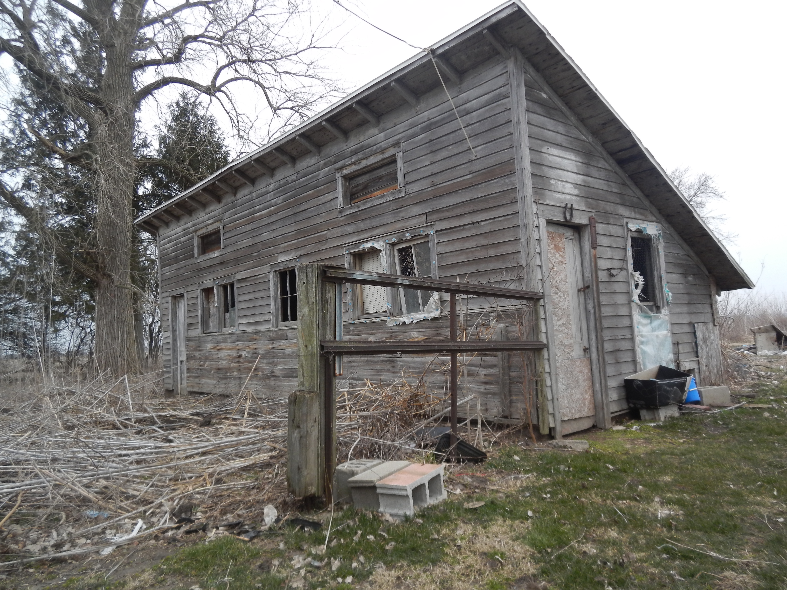

The chicken house at Sunny Crest is of the classic south-facing, slant-front style.  It has human-sized doors on the east wall and at the west side of the south wall, as well as smaller doors, for chickens only, on the east and north walls.  It has eleven roomy built-in laying nests, as well as a set of roosts on the east side.

This house features a pair of vents above the windows on the south side, which could be opened in the summertime to effect air circulation, and also in very cold weather, when the windows were shut tight, they could be open to exhaust moisture and carbon dioxide from the house.

The house is configured for a basic population of fifty hens.

The henhouse is of a classic south-facing design

