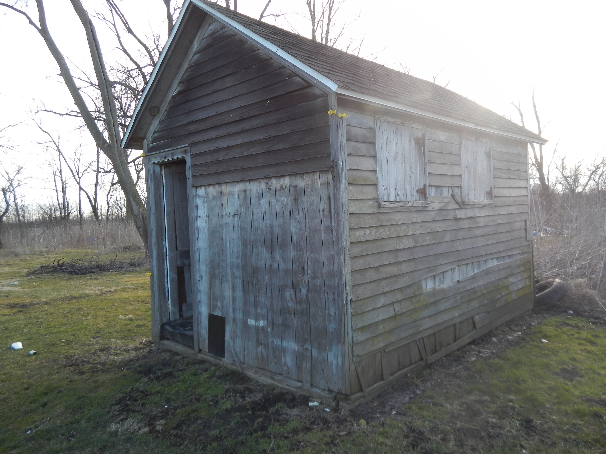

The cob house sits just southwest of the main house.  It has doors on each gable end, no windows, but three small barn-like doors on the north side, one of which is covered up by the clapboard siding.

When corn was shelled, the sheller would set up so that the cobs would be blown through the small barn doors into the house, which has a raised floor.  We are still investigating the manner in which the cobs were unloaded.  There are small square cutouts in the foundation on both of the log sides of the house.  Perhaps the area underneath them was used somehow to allow gravity to help get the cobs into the kitchen.  This is a topic about which there is very little information available online.

The cob house stored corncobs for use in the kitchen

