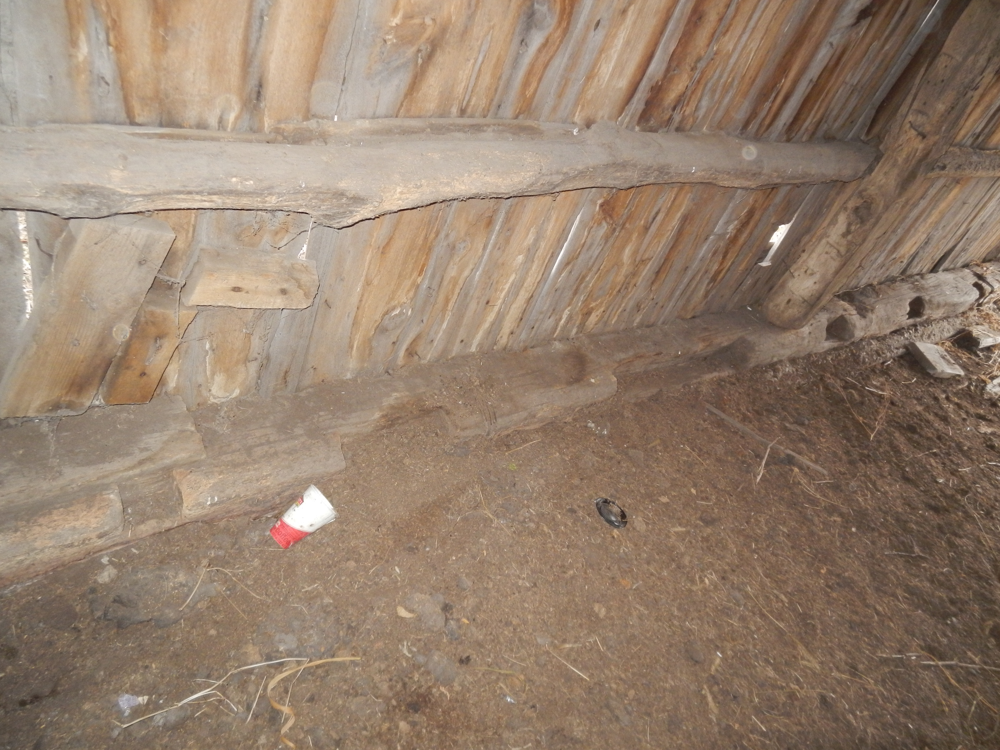
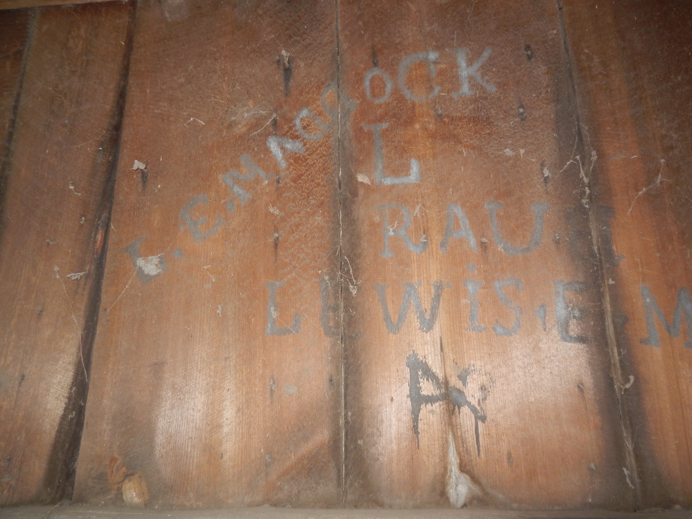

This shed is the oldest building on the property, and was constructed of hand-hewn beams and whole logs which have been hewn to fit as cross-members.  

The long sills have regularly spaced notches on either side, which match up perfectly.  On the north side, there are two notches which are much wider than all the rest of them, and one of those wide notches is almost twice as wide as the other.

Left to right, the second and third joist notches are much bigger than the others

---
We are investigating the possible implications of those notches, and hope they will serve as clues as to the original purpose for which this structure was built.

Josiah Portteus's cousin Lewis E. Maddock tagged this wall ca. 1875

Note the backwards "DD"

