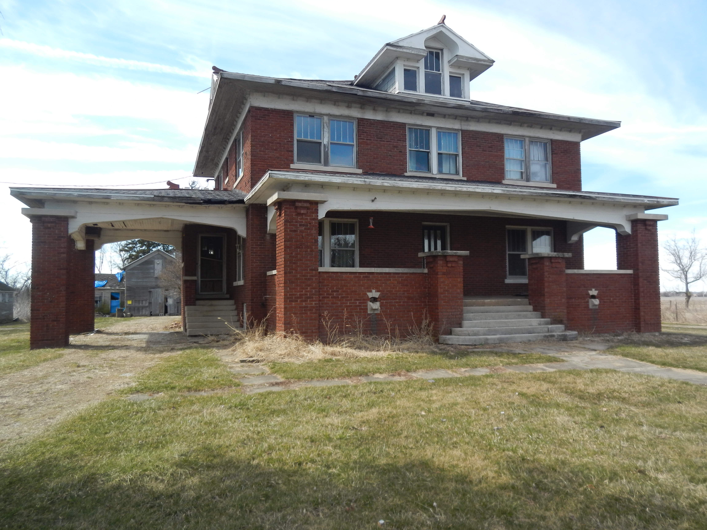

Josiah Lowes and Stella Shonkwiler Portteus purchased Sunny Crest in 1896, and until 1915 lived in the frame house now known as the "Old House." In 1915 they built the magnificent Craftsman Foursquare you see there today.  At that time, the old house was removed from its foundation, moved about 50 yards to the west, and converted into a garage and shop.

