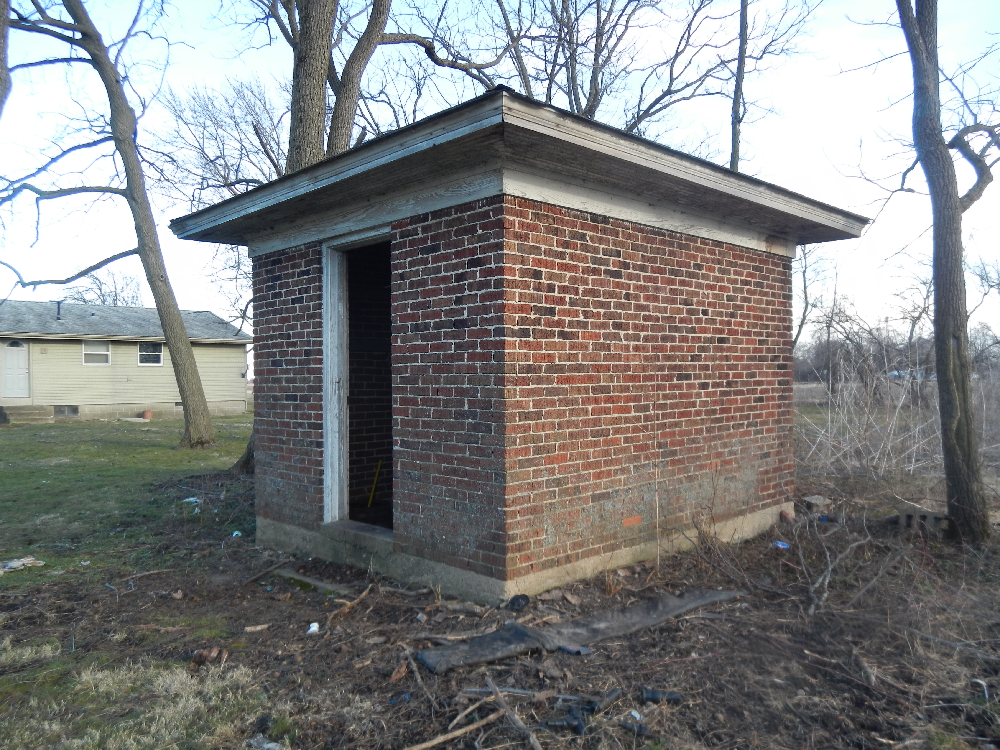

The oil house was constructed at the same time as the main house, and uses the same concrete foundation, brick construction, and slate roof.  It has a sunken concrete floor, with a door on the north side and a large, double-hung window on the south.

A wooden barrel of tar still sits on the floor, the tar as hard as rock but still redolent of the familiar aroma.  It appears that in later years broken and obsolete pieces of furniture were stored in this building.  It contains the remains of a fancy dresser with double silvered mirrors, as well as parts of a display case constructed by an artisan "maker" in the 1870s.

This house was used for the safe storage of flammable substances

