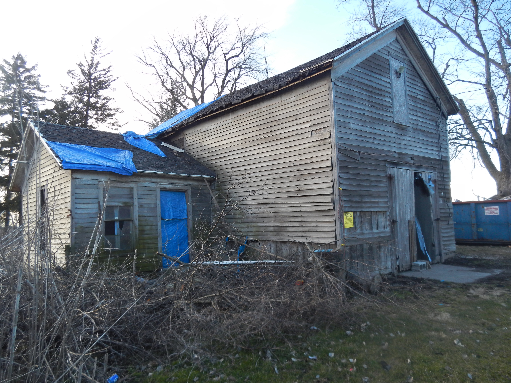

Information about the construction of the old house is unavailable.  However, given the materials that were used, it seems likely it was built sometime between the late 1860s through the 1870s.

That said, multiple pieces of evidence support William B. and Margaret Portteus Maddock being in the house in the early 1870s.  The Maddock family devoted itself to journalism, and various members were known throughout the state.  William Maddock founded the Benton Review in Fowler.

It has a large main wing, and two smaller additions.  One addition attaches to the main structure on its south side; the other attaches to the west side of the house and has a separate entrance.  I believe it was the kitchen.

The sills are made of hewn logs, and notches remain which held the floor joists.  It is one and a half stories, and the upstairs consists of two rooms.

View of old house taken from the southeast

